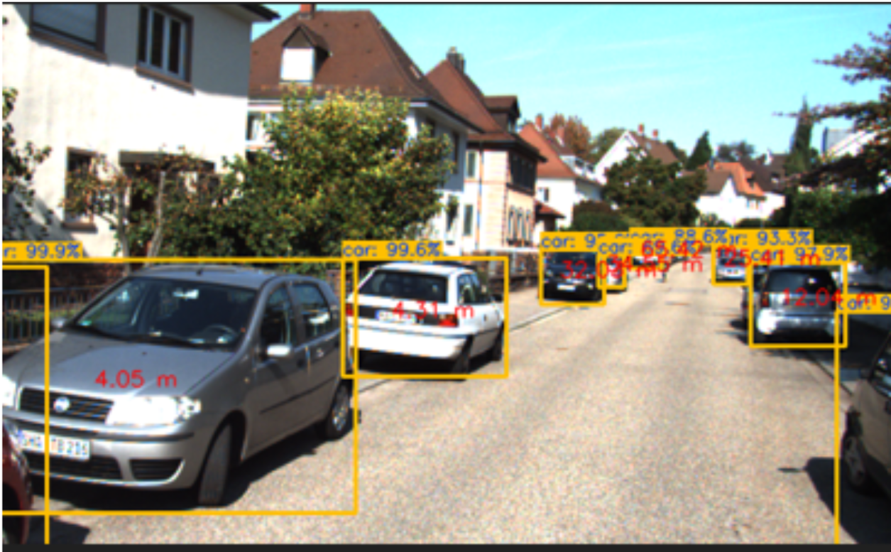

# Depth Estimation for AI in Autonomous Driving 

## Overview
This project focuses on stereo vision-based depth estimation, a crucial aspect of AI-powered autonomous driving. By leveraging computer vision techniques, the system computes 3D depth maps from stereo images, enabling machines to perceive the real world with human-like depth perception.
## Key Features and Results

 **Stereo Vision Processing** – Uses dual-camera images to estimate depth.
 **Disparity Map Calculation** – Generates disparity maps to measure depth perception.
 **Real-Time Depth Estimation** – Optimized for speed and efficiency in self-driving applications.
 **Obstacle Detection & Scene Understanding** – Aids in safe navigation and path planning.

Below are some results I got from the project:

## Applications
**Autonomous Vehicles** – Enhancing self-driving capabilities.
**Robotics & Drones** – Improving spatial awareness.
**Safety Systems** – Detecting obstacles for collision avoidance.
**Augmented & Virtual Reality** – Enabling immersive 3D experiences.

## References, Contributions & Feedback
Contributions are welcome! Feel free to fork this repository, open issues, or submit pull requests. Let’s collaborate to push AI-driven perception to the next level! 🚀
This project is part of the course on 3D Computer Vision by thinkautonomous.ai.

#AI #ComputerVision #AutonomousDriving #DepthEstimation #StereoVision

